# Задание 1. Модульная инфраструктура для нескольких сред

## 1. Подготовка облака

### 1.1. Создание облака и каталогов

Для реализации проекта создано отдельное облако `ya-architecture-pro` с тремя каталогами под каждую зону: `prod`, `stage`, `dev`.

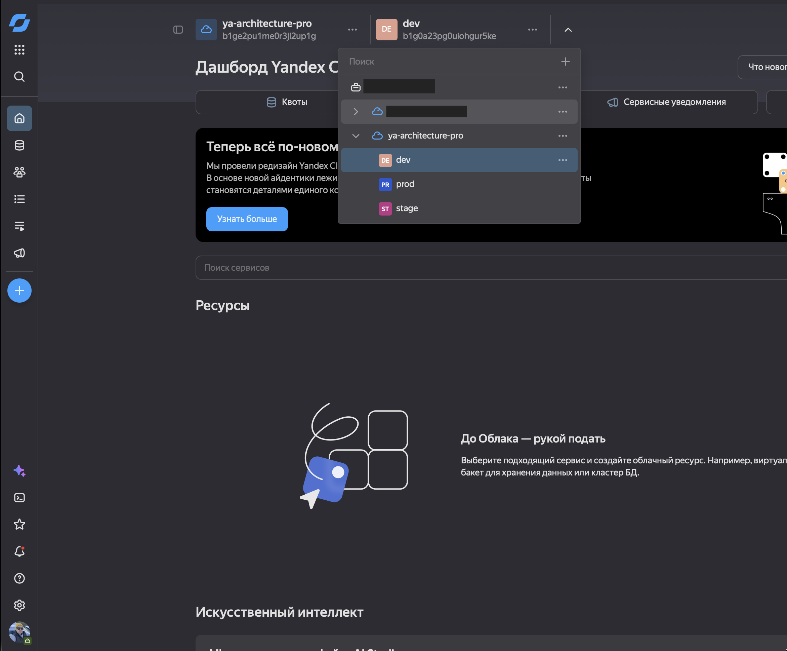

### 1.2. Создание подсетей для каталогов

Подсети созданы для каталогов в рамках одной сети, чтобы поместиться в квоты и не увеличивать их для облака. Важно понимать, что такая конфигурация не обеспечивает изоляцию окружений. Но в рамках текущего проекта принято решение этим пренебречь.

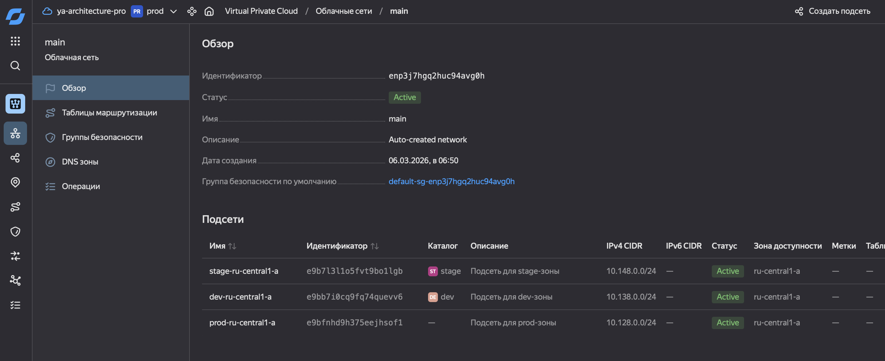

### 1.3. Образ Ubuntu 24.04

Идентификатор образа для использования в Terraform можно "подсмотреть" в каталоге Yandex Cloud:
`fd8ccfejmpaipf677j5c`

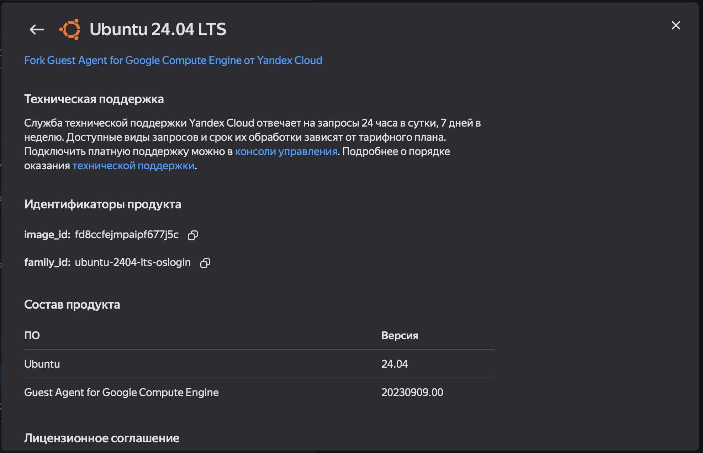

Для работы с Yandex Cloud нужно установить и настроить Yandex CLI:
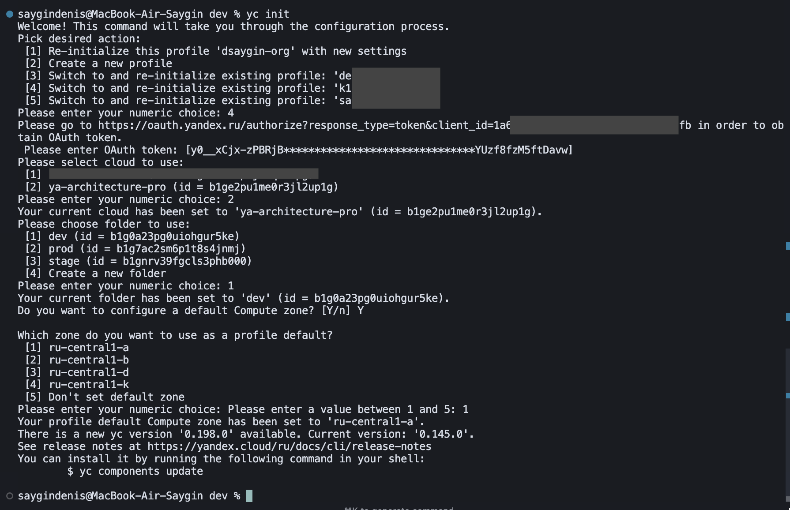

### 1.4. Публичный SSH-ключ (`ssh_public_key`)

Для подключения к созданным ВМ по SSH необходимо подготовить публичный ключ:

```bash
mkdir ~/.ssh/ya-architecture-pro
ssh-keygen -t ed25519 -C "d.i.saygin@yandex.ru" -f ~/.ssh/ya-architecture-pro/id_ed25519
```

Публичный ключ — содержимое файла с суффиксом `.pub`, например `~/.ssh/id_ed25519_yandex.pub`. Одну строку из этого файла и нужно подставить в переменную `ssh_public_key` в `.tfvars`:

```bash
cat ~/.ssh/id_ed25519_yandex.pub
# ssh-ed25519 AAAAC3NzaC1lZDI1NTE5AAAAI... your_email@example.com
```
Приватный ключ остаётся у на компьютере; в Terraform и в облако передаётся только публичный.

### 1.5. Сервисный аккаунт и аутентификация

Провайдер Yandex Cloud требует **токен** или ключ сервисного аккаунта. Без этого при `terraform plan` / `terraform apply` появляется ошибка:

```text
Error: one of 'token' or 'service_account_key_file' should be specified
```

В Yandex Cloud создан сервисный пользователь, для получения токена потребуется его идентификатор:

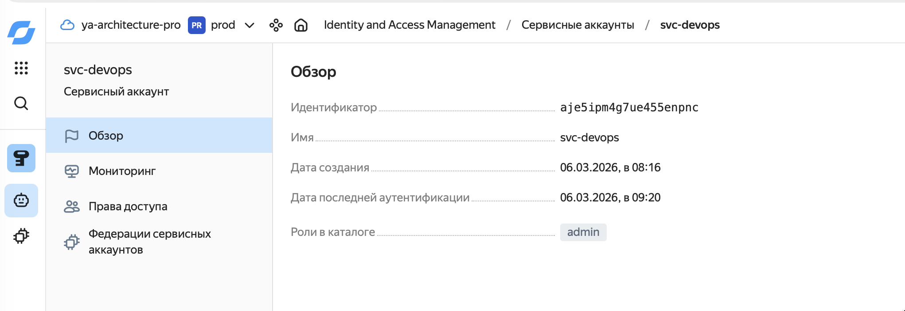

Перед запуском Terraform нужно выполнить в том же терминале:

```bash
export YC_TOKEN=$(yc iam create-token --impersonate-service-account-id aje5ipm4g7ue455enpnc)
```

После этого в **этом же терминале** нужно запускайть `terraform plan` и `terraform apply`. Провайдер читает токен из переменной окружения `YC_TOKEN`.

Документация: [Terraform Quickstart — Yandex Cloud](https://yandex.cloud/ru/docs/terraform/quickstart).

---

## 2. Структура

```
Task1Advanced/
├── modules/
│   └── vm/
│       ├── main.tf      # Ресурсы ВМ, подключаемый диск, сеть
│       ├── variables.tf # Входные параметры модуля
│       └── outputs.tf   # Выходные значения
├── envs/
│   ├── dev/             # Окружение разработки
│   ├── stage/           # Окружение предрелизного тестирования
│   └── prod/            # Продуктивное окружение
└── README.md
```

В каждом окружении (`envs/<env>/`) есть свой `main.tf`, `variables.tf`, `outputs.tf` и файл переменных `<env>.tfvars`.

---

## 3. Модуль `vm_module`

Модуль создаёт в Yandex Cloud:

- одну виртуальную машину с заданными CPU и RAM;
- загрузочный диск из указанного образа;
- отдельный подключаемый диск заданного размера и типа;
- сетевой интерфейс в указанной подсети (опционально с публичным IP через NAT).

Параметры полностью передаются через переменные, без привязки к конкретному окружению.

---

### 3.1. Запуск `Dev` окружения

Команды для инициализации и запуска Terraform для **Development:**

```bash
cd envs/dev
terraform init
terraform plan -var-file=dev.tfvars
terraform apply -var-file=dev.tfvars
```

Запуск `terraform plan`:

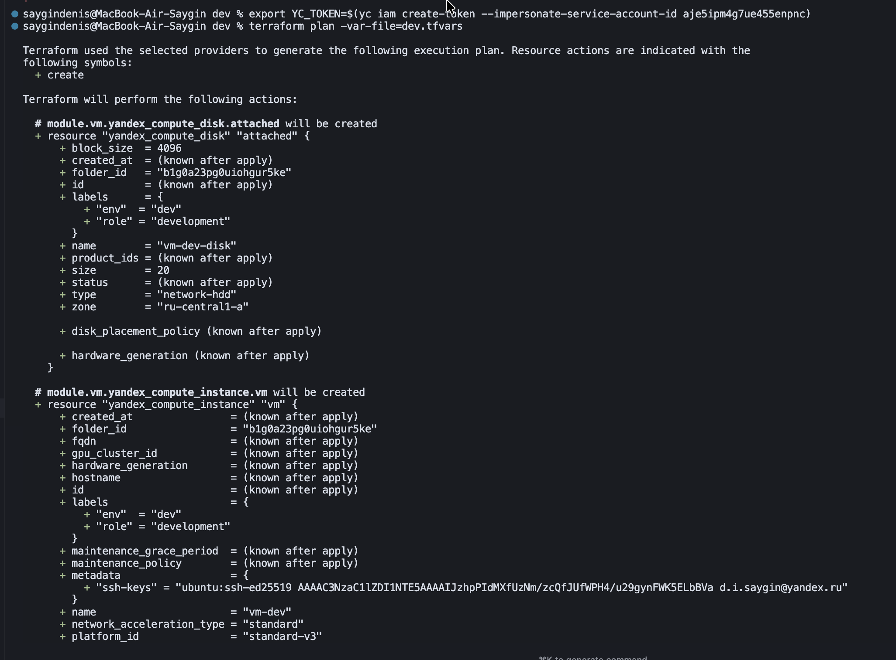

Запуск `terraform apply`:

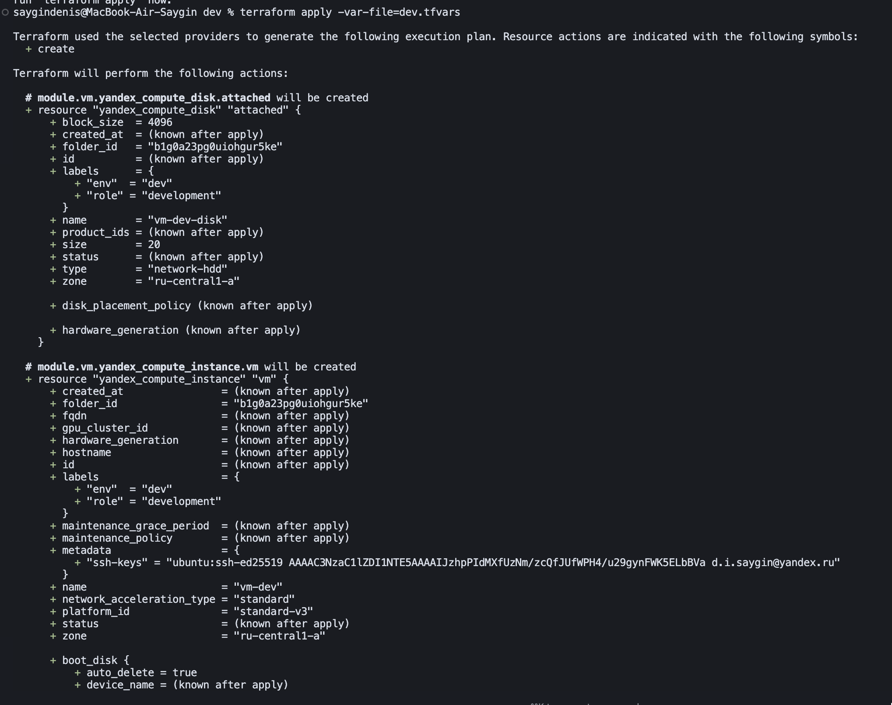
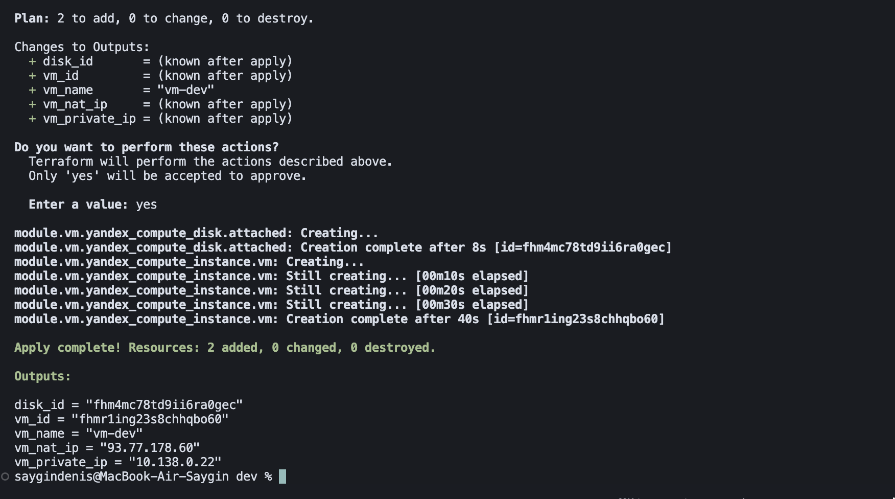

ВМ в процессе создания:

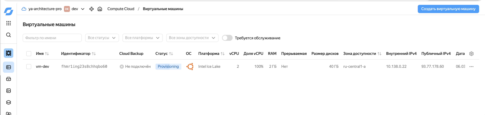

Запущенная ВМ:

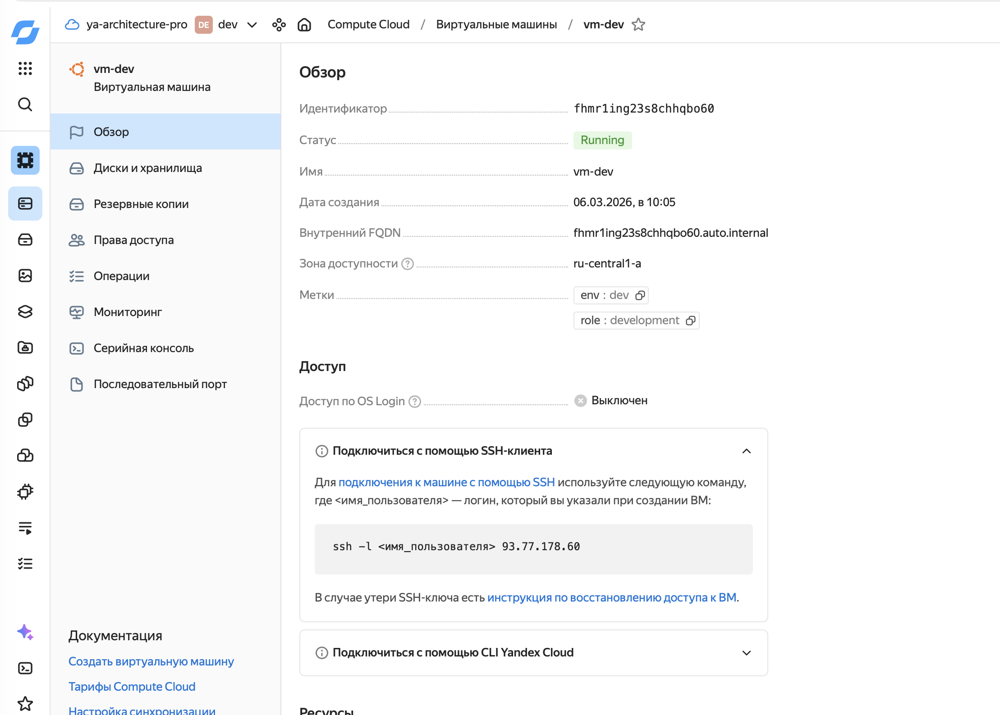

### 3.2. Запуск `Stage` окружения

Команды для инициализации и запуска Terraform для **Staging:**

```bash
cd envs/stage
terraform init
terraform plan -var-file=stage.tfvars
terraform apply -var-file=stage.tfvars
```

Запуск `terraform apply`:

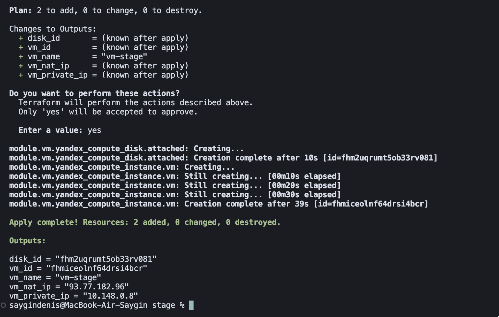

Запущенная ВМ:

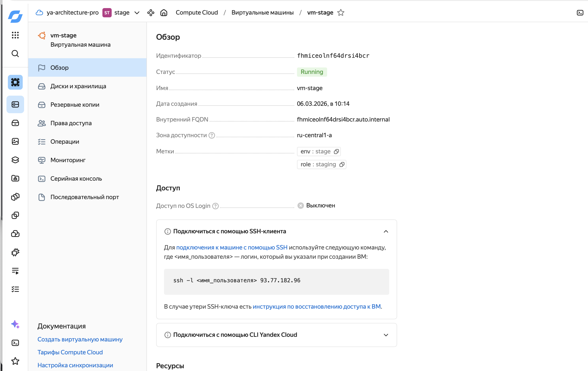

### 3.3. Запуск `Prod` окружения

Команды для инициализации и запуска Terraform для **Production:**

```bash
cd envs/prod
terraform init
terraform plan -var-file=prod.tfvars
terraform apply -var-file=prod.tfvars
```

Запуск `terraform apply`:

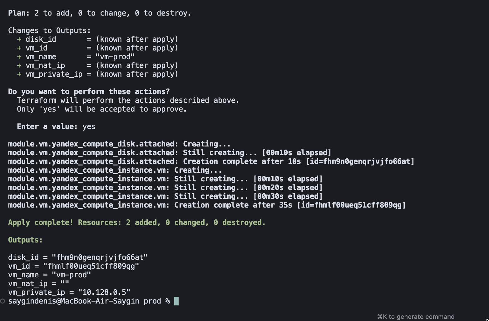

Запущенная ВМ:

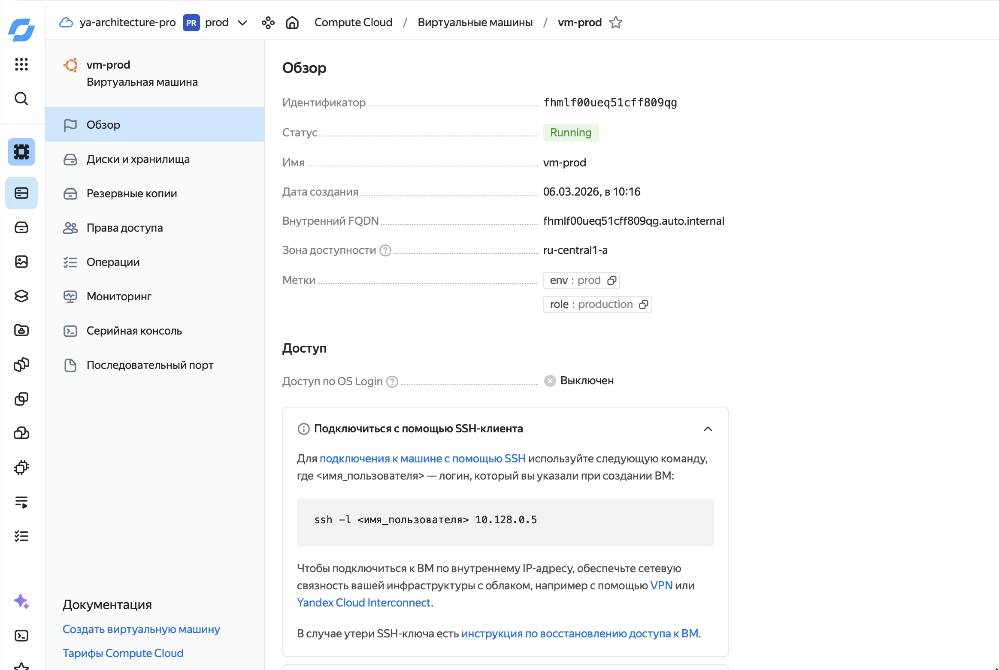

### 3.4. Различия конфигураций по окружениям

- **dev**: меньше ресурсов (2 ядра, 2 ГБ RAM, 20 ГБ диск, `network-hdd`), включён NAT.
- **stage**: средние ресурсы (4 ядра, 4 ГБ RAM, 50 ГБ `network-ssd`), включён NAT.
- **prod**: большие ресурсы (4 ядра, 8 ГБ RAM, 100 ГБ `network-ssd`), NAT отключён (доступ только из приватной сети).

---
