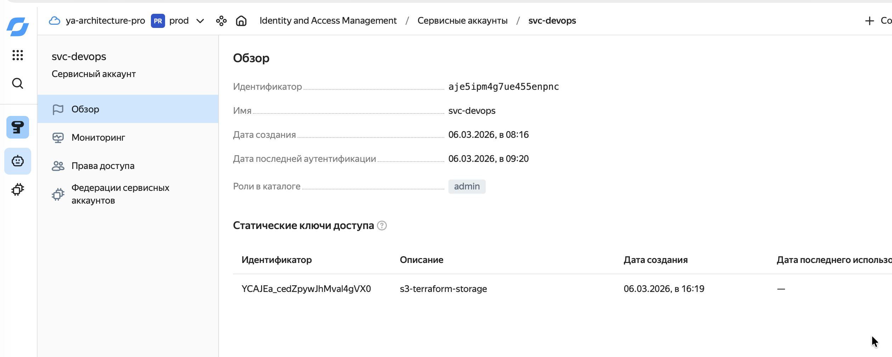
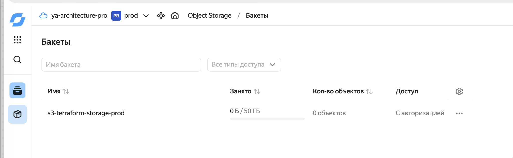
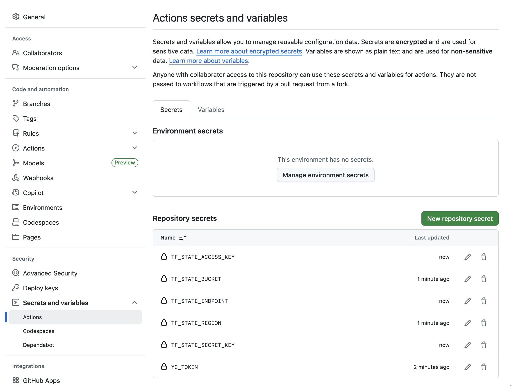
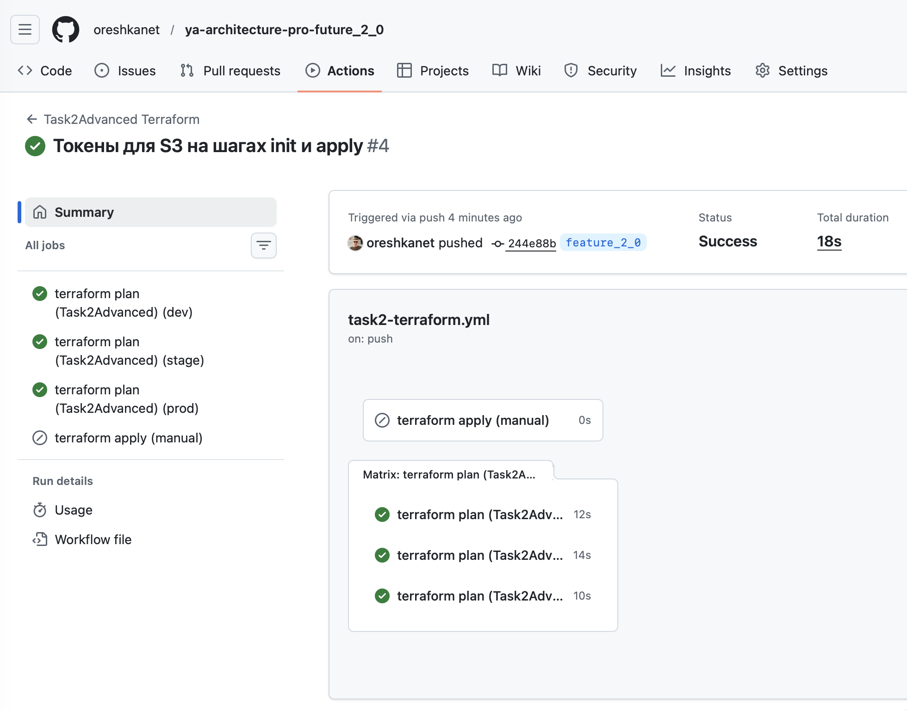
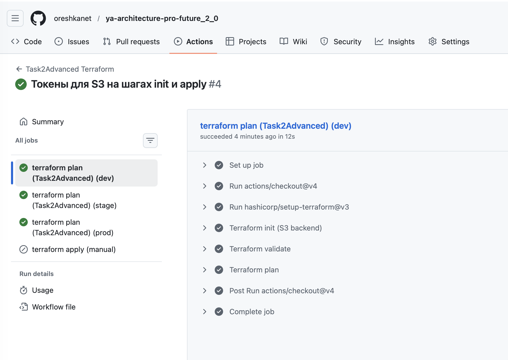
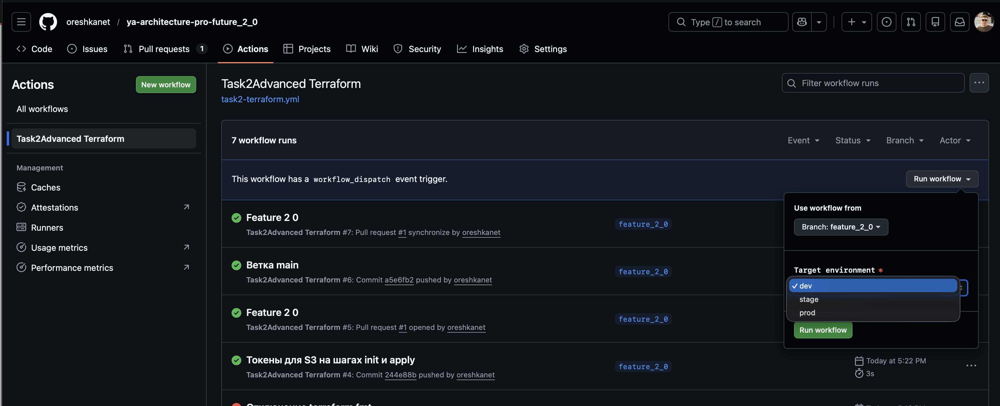
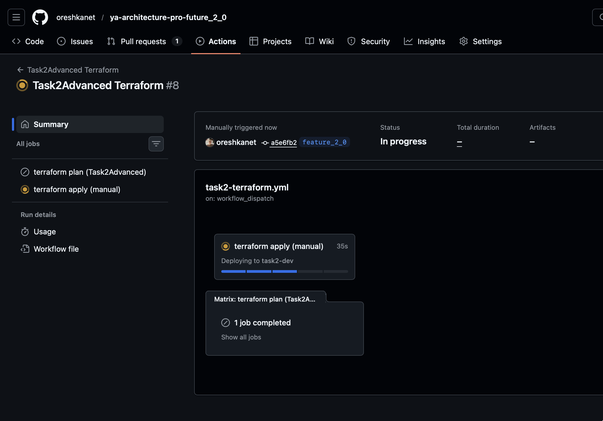
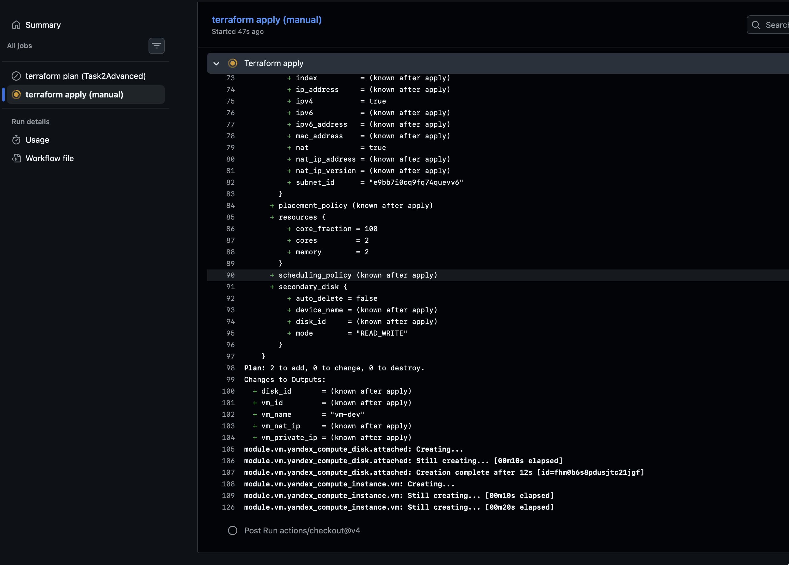
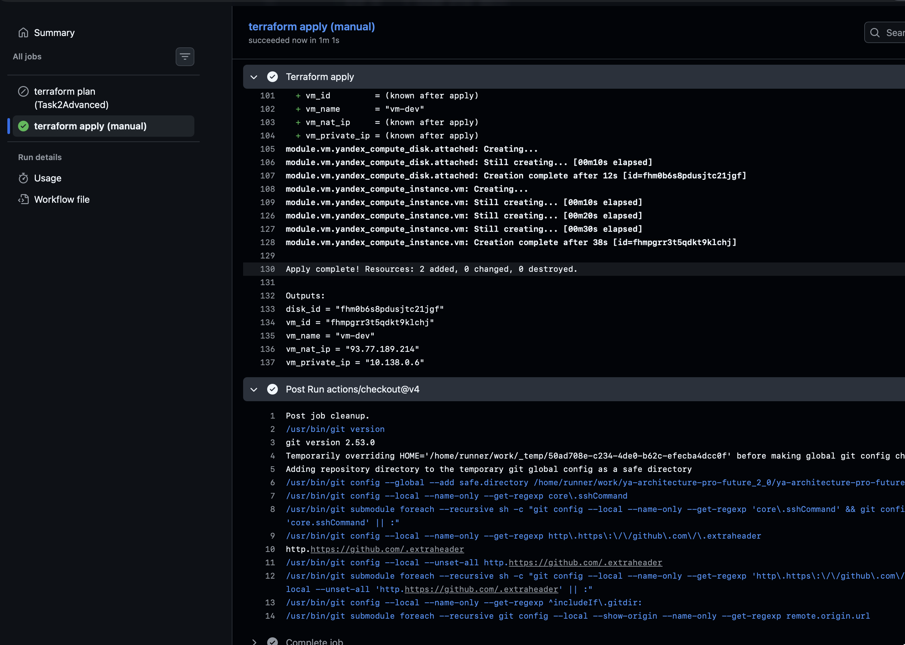
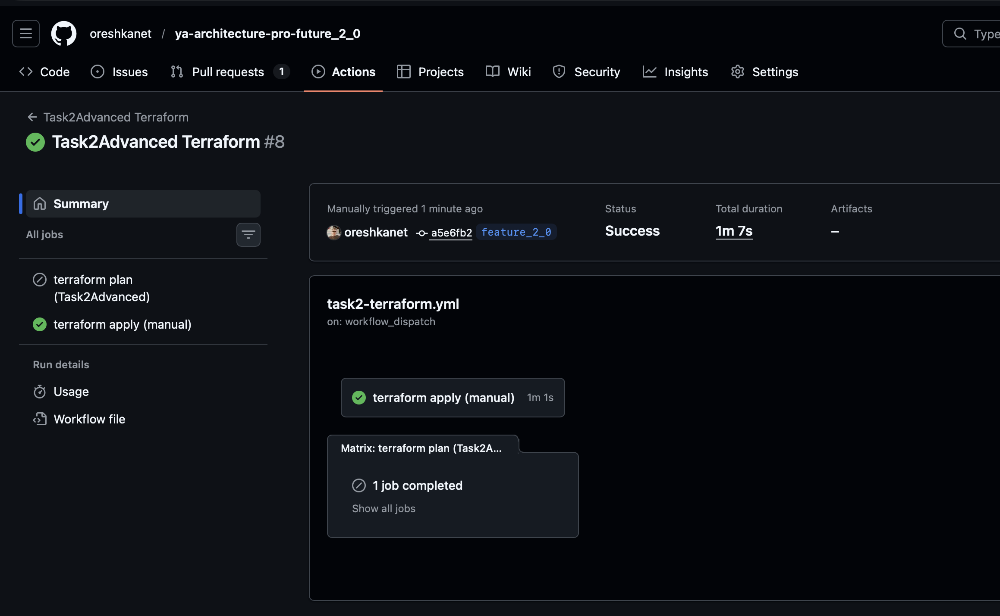

# Задание 2. Интеграция с CI/CD и удалённым хранением состояния

## 1. Подготовка облака

Создан сервисный пользователь svc-devops с правами управления ресурсами:


Статические ключи для доступа к S3: 



Бакет в S3:



---

## 2. Структура

```
Task2Advanced/
├── modules/
│   └── vm/
│       ├── main.tf
│       ├── variables.tf
│       └── outputs.tf
└── envs/
    ├── dev/
    │   ├── backend.tf
    │   ├── main.tf
    │   ├── variables.tf
    │   ├── outputs.tf
    │   └── dev.tfvars
    ├── stage/
    │   └── ...
    └── prod/
        └── ...
```

---

## 3. Backend: S3 удалённое хранение

В каждом окружении есть `backend.tf`:

```hcl
terraform {
  backend "s3" {}
}
```

Все параметры backend’а подаются при `terraform init` через `-backend-config=...`, чтобы:

- **не хранить секреты** (access_key/secret_key) в репозитории;
- легко переключать MinIO/Yandex Object Storage/AWS S3.

---

## 4. Аутентификация Yandex Cloud

Для провайдера `yandex-cloud/yandex` нужен IAM-токен (или key-файл сервисного аккаунта). Самый простой вариант — токен:

```bash
export YC_TOKEN="$(yc iam create-token)"
```

Используется сервисный аккаунт:

```bash
export YC_TOKEN="$(yc iam create-token --impersonate-service-account-id aje5ipm4g7ue455enpnc)"
```

---

## 5. CI/CD (GitHub Actions)

Workflow: `.github/workflows/task2-terraform.yml`

### Что делает pipeline

- **На PR и push** (изменения в `Task2Advanced/**`):
  - `terraform init` (S3 backend, параметры из секретов)
  - `terraform validate`
  - `terraform plan` для `dev`, `stage`, `prod`
- **Apply**:
  - запускается **вручную** через `workflow_dispatch`
  - параметр `environment` выбирается из `dev|stage|prod`
  - state ключ: `task2/<env>/terraform.tfstate`


### 5.1. Секреты/переменные, которые нужны в репозитории

В GitHub Secrets нужно добавить:

- `YC_TOKEN` — IAM token для Yandex Cloud
- `TF_STATE_BUCKET` — bucket для state
- `TF_STATE_REGION` — регион (для MinIO может быть любым, например `ru-central1`)
- `TF_STATE_ENDPOINT` — endpoint S3 (например `https://storage.yandexcloud.net` или `http://minio:9000`)
- `TF_STATE_ACCESS_KEY` — access key
- `TF_STATE_SECRET_KEY` — secret key



### 5.2. Workflow для plan





### 5.3. Workflow для apply











> https://github.com/oreshkanet/ya-architecture-pro-future_2_0/actions/runs/22771691033

---