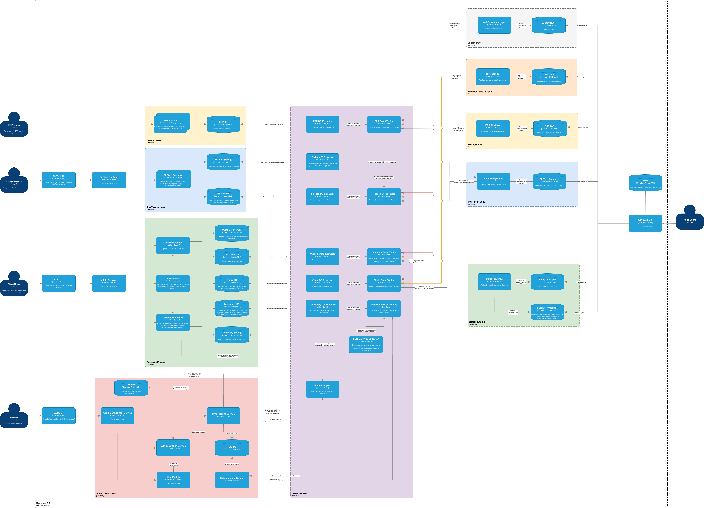
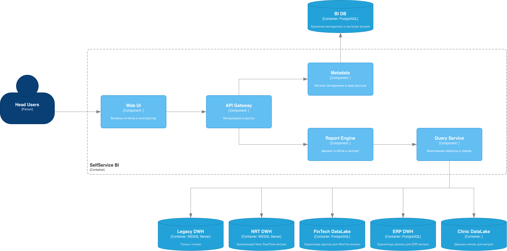
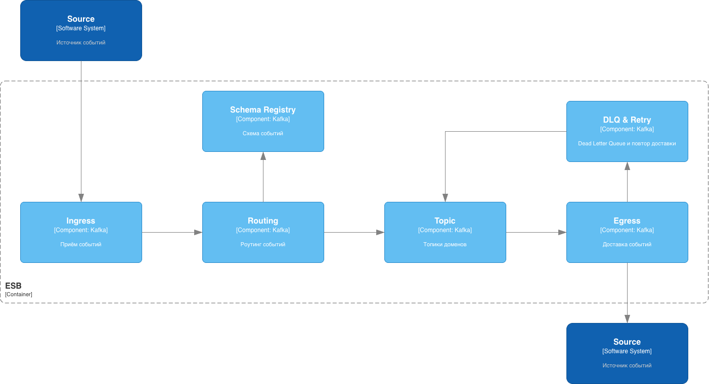
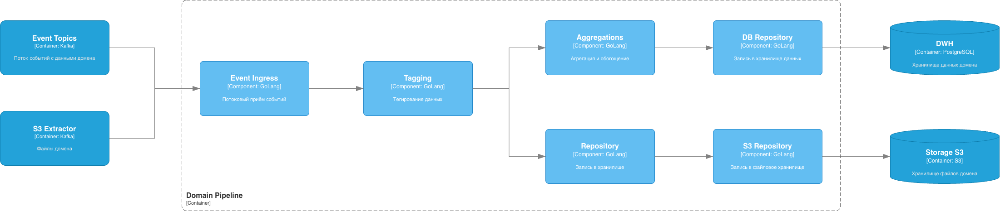

# Задание 3. Проектирование целевой архитектуры и оценка рисков внедрения

## 1. C4: уровень контейнеров (Container Diagram)

На диаграмме ниже — целевые **контейнеры** (системы) через 3 года: домены, единая шина событий, витрина данных, мосты совместимости и постепенный вывод легаси.

[C4-Container](./diagram/C4-Container.png)

---

## 2. C4: уровень компонентов

### 2.1. Портал витрины данных (Self-Service BI)

[C4-Component-SelfServiceBI](./diagram/C4-Component-SelfServiceBI.png)

### 2.2. Шина событий (ESB)

[C4-Component-ESB](./diagram/C4-Component-ESB.png)

### 2.3. Доменное хранилище и потоковая витрина

[C4-Component-PipelineDWH](./diagram/C4-Component-PipelineDWH.png)

---

## 3. Изменение систем при масштабировании

| Аспект | Текущее состояние | Целевое (3 года) |
|--------|-------------------|------------------|
| **Новые бизнес-направления** | Логика и данные в едином DWH, рост связности. | Новые домены подключаются через шину событий и собственные витрины; витрина данных масштабируется за счёт новых источников без переделки ядра. |
| **Источники данных** | В основном DWH + часть через Camel. | Множество источников: события из доменов, потоковые витрины, доменные хранилища; антикоррупционный слой и мост к DWH только на переходный период. |
| **Легаси-системы** | DWH (SQL Server 2008), PowerBuilder, Camel, тяжёлая кастомизация BI. | DWH и Camel — только мосты; поэтапный перенос логики в доменные сервисы и шину событий; отказ от точечных синхронных интеграций на критическом пути; PowerBuilder заменяется веб-интерфейсами доменов и порталом витрины. |
| **Отчётность** | Долгая сборка отчётов, кастомная логика в DWH и BI. | Портал витрины данных с разделением на доменные и потоковые витрины; near real-time где нужно; единые принципы доступа и прав. |
| **Масштабирование** | Ограничено монолитным DWH и связкой BI–DWH. | Масштабирование по доменам и по платформе событий; витрина данных масштабируется независимо за счёт добавления доменов и витрин. |

---

## 4. Карта рисков трансформации

## 4.1. Архитектурные риски

| № | Риск | Вероятность | Влияние |
|---|------|-------------|---------|
| A1 | Долгая или неполная миграция с DWH: остаточная бизнес-логика в легаси, дублирование данных и несогласованность между DWH и новыми доменными хранилищами | Средняя | Высокое |
| A2 | Несогласованность форматов и схем событий между доменами и партнёрами — рост количества трансформаций и хрупких интеграций | Средняя | Высокое |
| A3 | Перегрузка шины событий или неправильный выбор технологий (масштаб, задержки, стоимость), что ограничивает переход на near real-time | Средняя | Среднее |
| A4 | Недостаточная изоляция доменов: изменения в одном домене требуют доработок в других или в центральной витрине | Низкая | Высокое |
| A5 | Зависимость витрины данных от «мостов» к DWH и Camel: затягивание вывода легаси и рост технического долга | Высокая | Среднее |
| A6 | Несоответствие целевой архитектуры регуляторным требованиям (медицина, финансы, персональные данные) | Низкая | Высокое |

---

## 4.2. Организационные риски

| № | Риск | Вероятность | Влияние |
|---|------|-------------|---------|
| O1 | Сопротивление изменениям со стороны подразделений и ключевых пользователей (PowerBuilder, привычные отчёты) | Высокая | Среднее |
| O2 | Нехватка компетенций по событийной архитектуре, потоковой обработке и облаку в текущей команде | Средняя | Высокое |
| O3 | Размытые зоны ответственности между доменами и центральной платформой (события, витрина, мосты) | Средняя | Среднее |
| O4 | Несогласованность приоритетов между головным офисом, клиниками, финтехом и ИИ-направлением — задержки пилотов и решений | Средняя | Высокое |
| O5 | Уход ключевых специалистов, знающих легаси DWH и бизнес-логику, во время трансформации | Средняя | Высокое |
| O6 | Недостаточное вовлечение бизнеса в приёмку витрины данных и новых процессов | Высокая | Среднее |

---

## 4.3. Технологические риски

| № | Риск | Вероятность | Влияние |
|---|------|-------------|---------|
| T1 | Производительность и стабильность при миграции сотен ТБ из DWH в облако и в новые хранилища | Средняя | Высокое |
| T2 | Сбои и задержки в работе витрины данных и отчётности в переходный период (одновременная работа со старым и новым контуром) | Средняя | Высокое |
| T3 | Уязвимости безопасности и утечки при работе с медицинскими и финансовыми данными в новой архитектуре | Низкая | Высокое |
| T4 | Несовместимость или нестабильность интеграций с внешними партнёрами при переходе на события | Средняя | Среднее |
| T5 | Рост затрат на облако и лицензии при масштабировании без должного контроля использования ресурсов | Высокая | Среднее |
| T6 | Зависимость от единого поставщика облака или ключевых компонентов платформы | Средняя | Среднее |

---

# 5. План управления рисками

## 5.1. Архитектурные риски

### A1. Долгая или неполная миграция с DWH, дублирование и несогласованность данных

| Мера | Тип | Описание |
|------|-----|----------|
| Поэтапный перенос по доменам | Управленческий | Чёткая очередность доменов (пилот -> критические -> остальные), критерии готовности вывода из DWH. |
| Антикоррупционный слой и контракты | **Технический** | Единый слой адаптации к DWH, публикация только в форматах целевой шины; уменьшение прямых связей с легаси. |
| Реестр источников правды | Управленческий | Закрепление за каждым типом данных владельца и единственного источника правды в целевой архитектуре. |
| Инкрементальная миграция логики | **Технический** | Перенос правил из DWH в доменные сервисы и потоковые витрины по частям с проверкой консистентности. |

### A2. Несогласованность форматов и схем событий

| Мера | Тип | Описание |
|------|-----|----------|
| Каталог схем событий (Schema Registry) | **Технический** | Централизованный каталог с версионированием; валидация при публикации и подписке. |
| Стандарты именования и жизненного цикла | Управленческий | Регламент по формату событий, обратной совместимости и устареванию версий; согласование между доменами. |
| Контракты работы с событиями | **Технический** | Тесты контрактов между издателями и подписчиками. |

### A3. Перегрузка шины событий, неудачный выбор технологий

| Мера | Тип | Описание |
|------|-----|----------|
| Нагрузочное тестирование и пилоты | **Технический** | Пилоты в 1–2 доменах с замером задержек, пропускной способности и стоимости; выбор технологий на основе метрик. |
| Мониторинг и лимиты | **Технический** | Квоты на объём и частоту публикации по доменам, алерты и автоскейлинг. |
| Архитектурный надзор | Управленческий | Решения по шине и стеку принимаются с учётом целевой архитектуры и ограничений. |

### A4. Недостаточная изоляция доменов

| Мера | Тип | Описание |
|------|-----|----------|
| Чёткие границы доменов (DDD) | Управленческий | Фиксация границ доменов и контрактов между ними в архитектурной документации и регламентах. |
| Взаимодействие только через события | **Технический** | Запрет прямых вызовов между доменами; только шина событий и публичные контракты. |
| Отдельные среды и права в облаке | **Технический** | Разделение окружений и IAM по доменам. |

### A5. Зависимость витрины от мостов к DWH/Camel

| Мера | Тип | Описание |
|------|-----|----------|
| Дедлайны вывода мостов | Управленческий | Жёсткие сроки по этапам (6–18–36 мес.) и критерии отключения мостов. |
| Приоритизация переноса критичных потоков | Управленческий | Сначала переносятся сценарии, без которых невозможен отказ от DWH в витрине. |
| Метрики "доли данных вне легаси" | **Технический** | Дашборды по проценту трафика и отчётов, идущих уже из новых витрин, а не из DWH. |

### A6. Несоответствие регуляторным требованиям

| Мера | Тип | Описание |
|------|-----|----------|
| Вовлечение compliance и юристов | Управленческий | Оценка целевой архитектуры на соответствие 152-ФЗ, отраслевым требованиям медицины и банка. |
| Аудит доступа и шифрование | **Технический** | Разграничение доступа к персональным и медицинским данным, шифрование в покое и при передаче, аудит логирование. |
| Документирование потоков данных | Управленческий | Реестр обработки персональных данных и карты потоков для регуляторов. |

---

## 5.2. Организационные риски

### O1. Сопротивление изменениям

| Мера | Тип | Описание |
|------|-----|----------|
| Раннее вовлечение пользователей и лидеров мнений | Управленческий | Участие клиник, офиса и финтеха в пилотах и приёмке витрины данных; обратная связь и демо. |
| Обучение и инструкции | Управленческий | Обучение работе с новым порталом витрины, миграция с PowerBuilder по шагам с поддержкой. |
| Постепенный вывод старых интерфейсов | Управленческий | Параллельная работа старого и нового контура до стабилизации и принятия бизнесом. |

### O2. Нехватка компетенций (события, потоковая обработка, облако)

| Мера | Тип | Описание |
|------|-----|----------|
| Обучение и сертификации | Управленческий | Планы обучения по event-driven, стримингу и облаку; внутренние воркшопы. |
| Привлечение экспертов и партнёров | Управленческий | Внешние архитекторы и команды на этапе проектирования и пилотов. |
| Переиспользование референсных решений | **Технический** | Использование готовых паттернов (документация, примеры кода, шаблоны пайплайнов) для ускорения разработки. |

### O3. Размытые зоны ответственности

| Мера | Тип | Описание |
|------|-----|----------|
| RACI по платформе и доменам | Управленческий | Матрица ответственности: шина событий, витрина данных, мосты, доменные сервисы. |
| Владельцы доменов и продуктов | Управленческий | Назначение владельцев доменов и витрины данных; регулярные архитектурные советы. |

### O4. Несогласованность приоритетов между подразделениями

| Мера | Тип | Описание |
|------|-----|----------|
| Единый комитет по трансформации | Управленческий | Совместное согласование этапов, приоритетов и ресурсов (офис, клиники, финтех, ИИ). |
| Дорожная карта с вехами | Управленческий | Публичная дорожная карта с ключевыми вехами и критериями приёмки по этапам. |

### O5. Уход ключевых специалистов

| Мера | Тип | Описание |
|------|-----|----------|
| Документирование знаний по DWH и логике | Управленческий | Регулярная фиксация бизнес-правил, скриптов и потоков данных в DWH; передача знаний. |
| Ротация и кросс-обучение | Управленческий | Вовлечение нескольких людей в критические области; снижение зависимости от одного специалиста. |
| Мотивация и удержание | Управленческий | Роль ключевых людей в трансформации, карьерные и материальные стимулы. |

### O6. Недостаточное вовлечение бизнеса в приёмку витрины данных и новых процессов

| Мера | Тип | Описание |
|------|-----|----------|
| UX и обратная связь от пользователей | Управленческий и технический | Удобный интерфейс витрины, сбор обратной связи и быстрые итерации. |
| Быстрые результаты в пилотах | Управленческий | Выбор сценариев, дающих быструю пользу (например, отчёты для руководства), и их продвижение. |
| Метрики использования | **Технический** | Аналитика по использованию витрины (активные пользователи, популярные отчёты) для корректировки продукта. |

---

## 5.3. Технологические риски

### T1. Производительность и стабильность миграции сотен ТБ

| Мера | Тип | Описание |
|------|-----|----------|
| Поэтапная миграция по доменам и наборам данных | **Технический** | Разбиение на этапы, инкрементальная загрузка, проверка целостности после каждого этапа. |
| Инструменты миграции и мониторинг | **Технический** | Использование проверенных инструментов (например, репликация, ETL в облаке), мониторинг прогресса и ошибок. |
| Резервное окно и откат | Управленческий | Планы отката и возможность продолжения работы на старом контуре при сбоях миграции. |

### T2. Сбои и задержки витрины в переходный период

| Мера | Тип | Описание |
|------|-----|----------|
| Резервирование и отказоустойчивость | **Технический** | Кластеризация, мульти-зональность, автоматическое переключение при сбоях. |
| Мониторинг и SLA | **Технический** | SLA по доступности и времени ответа витрины; алерты и быстрая эскалация. |
| Коммуникация с бизнесом при инцидентах | Управленческий | Регламент оповещения и временные процедуры при недоступности витрины. |

### T3. Уязвимости безопасности и утечки

| Мера | Тип | Описание |
|------|-----|----------|
| Аудит безопасности архитектуры и кода | **Технический** | Регулярный аудит и пентесты; проверка доступа к мед- и фин-данным. |
| Шифрование и контроль доступа | **Технический** | Шифрование в покое и при передаче; RBAC, минимальные привилегии, аудит доступа. |
| Политики и обучение | Управленческий | Регламенты по работе с персональными данными, обучение сотрудников. |

### T4. Несовместимость интеграций с партнёрами

| Мера | Тип | Описание |
|------|-----|----------|
| Адаптеры и контракты | **Технический** | Адаптеры под форматы партнёров; версионирование API и событий; тесты на совместимость. |
| Совместные пилоты с ключевыми партнёрами | Управленческий | Раннее согласование форматов и сценариев с фармой и поставщиками. |

### T5. Рост затрат на облако

| Мера | Тип | Описание |
|------|-----|----------|
| Бюджеты и алерты по затратам | **Технический** | Квоты и лимиты по проектам/доменам; алерты при превышении. |
| Оптимизация использования ресурсов | **Технический** | Автоскейлинг, выбор типов инстансов, архивирование старых данных. |
| Регулярный пересмотр затрат | Управленческий | Ежемесячный/ежеквартальный разбор затрат по доменам и инициативам. |

### T6. Зависимость от единого поставщика облака или ключевых компонентов платформы

| Мера | Тип | Описание |
|------|-----|----------|
| Абстракции и стандартные протоколы | **Технический** | Использование открытых протоколов (Kafka-совместимость, S3-совместимое хранилище), абстракции над облачными сервисами где возможно. |
| Стратегия мульти-облака или смены поставщика | Управленческий | Документирование критичных зависимостей и сценариев смены поставщика; оценка стоимости перехода. |

---

