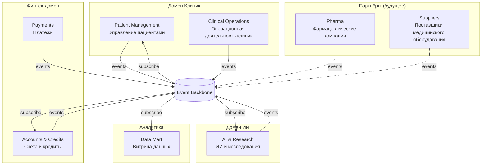

# Схема Bounded Contexts (DDD)

---

| Bounded Context | Ответственность | Ключевые агрегаты | Взаимодействие |
|-----------------|-----------------|-------------------|----------------|
| **Patient Management** | Регистрация и учёт пациентов, запись на приём, идентификация в рамках экосистемы | Patient, Appointment | Публикует: PatientRegistered, AppointmentScheduled. Подписывается на события от Fintech (для привязки платежей/кредитов к пациенту). |
| **Clinical Operations** | Приёмы, расписание, инвентаризация, персонал клиник. Медкарты и истории болезни — только внутри контекста, в витрину не отдаются | Visit, Staff, Inventory | Публикует: VisitCompleted, ResourceBooked. Подписывается на события ИИ (результаты исследований для врачей). |
| **Accounts & Credits** | Счета клиентов, кредитные договоры, продукты банка | Account, CreditContract | Публикует: CreditContractCreated, AccountOpened. Подписывается на PatientRegistered (привязка клиента). |
| **Payments** | Платежи, списания, история операций по счёту | Payment, Transaction | Публикует: PaymentReceived, PaymentFailed. Подписывается на события счётов и кредитов. |
| **AI & Research** | Обработка медицинских данных ИИ, результаты исследований и диагностики (для клиник), монетизация ИИ-функций | ResearchJob, AIResult | Публикует: StudyCompleted, AIResultReady. Подписывается на события клиник (запросы на исследование, завершённые приёмы). |
| **Data Mart** | Витрина данных: агрегаты для отчётности, срезы по правам доступа, self-service отчёты. Медицинские карты и сырые результаты ИИ не включаются | ReportDefinition, DataSlice | Только подписчик: потребляет события из всех доменов для построения витрин и отчётности. |
| **Pharma** | Интеграция с фармацевтическими компаниями (новые направления) | Order, Shipment | Публикует: OrderPlaced, ShipmentDelivered. Подписывается на события клиник/складов. |
| **Suppliers** | Заказы, поставки, интеграция с производителями медоборудования (новые направления) | Order, Shipment | Публикует: OrderPlaced, ShipmentDelivered. Подписывается на события клиник/складов. |

---
