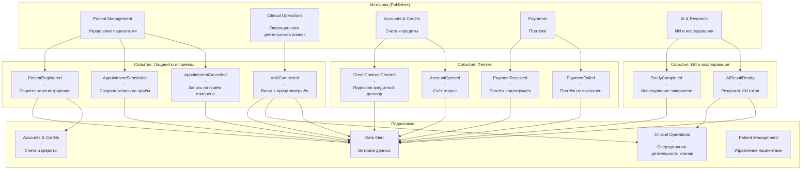

# Event Storming — целевая событийная архитектура

```mermaid
flowchart TB
    subgraph sources ["Источник (Publisher)"]
        S1["`Patient Management
            -
            Управление пациентами`"]
        S2["`Clinical Operations
            -
            Операционная деятельность клиник`"]
        S3["`Accounts & Credits
            -
            Счета и кредиты`"]
        S4["`Payments
            -
            Платежи`"]
        S5["`AI & Research
            -
            ИИ и исследования`"]
    end

    subgraph patient_events ["События: Пациенты и приёмы"]
        E1["`PatientRegistered
            -
            Пациент зарегистрирован`"]
        E2["`AppointmentScheduled
            -
            Создана запись на приём`"]
        E3["`AppointmentCancelled
            -
            Запись на приём отменена`"]
        E4["`VisitCompleted
            -
            Визит к врачу завершён`"]
    end

    subgraph fintech_events ["События: Финтех"]
        E5["`CreditContractCreated
            -
            Подписан кредитный договор`"]
        E6["`AccountOpened
            -
            Счёт открыт`"]
        E7["`PaymentReceived
            -
            Платёж подтверждён`"]
        E8["`PaymentFailed
            -
            Платёж не выполнен`"]
    end

    subgraph ai_events ["События: ИИ и исследования"]
        E9["`StudyCompleted
            -
            Исследование завершено`"]
        E10["`AIResultReady
            -
            Результат ИИ готов`"]
    end

    subgraph subscribers ["Подписчики"]
        D1["`Data Mart
            -
            Витрина данных`"]
        D2["`Accounts & Credits
            -
            Счета и кредиты`"]
        D3["`Clinical Operations
            -
            Операционная деятельность клиник`"]
        D4["`Patient Management
            -
            Управление пациентами`"]
    end

    S1 --> E1
    S1 --> E2
    S1 --> E3
    S2 --> E4
    S3 --> E5
    S3 --> E6
    S4 --> E7
    S4 --> E8
    S5 --> E9
    S5 --> E10

    E1 --> D1
    E1 --> D2
    E2 --> D1
    E3 --> D1
    E4 --> D1
    E4 --> D3
    E4 --> D1
    E5 --> D1
    E6 --> D1
    E7 --> D1
    E8 --> D1
    E9 --> D1
    E10 --> D3
    E10 --> D1
```